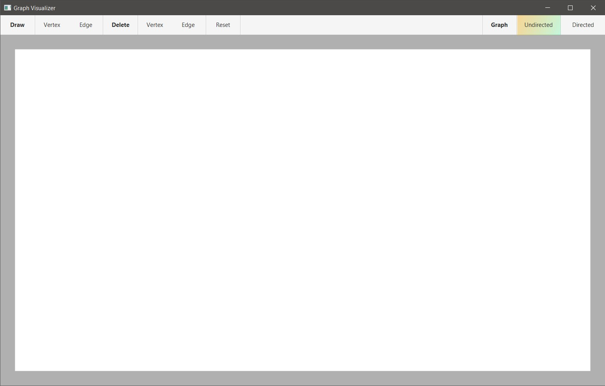

#Graph Visualizer

##Synopsis

Graph Visualizer application provides the tools to _create an undirected and directed graph_. Tools to add and delete a
vertex and edge are available. Option to switch between directed and undirected graph is also available.

##Table of Contents

> * [Title](#steganography)
>   * [Synopsis](#synopsis)
>   * [Table of Contents](#table-of-contents)
>   * [Dependencies](#dependencies)
>   * [Installation Guide](#installation-guide)
>   * [Usage](#usage)

##Dependencies

- JavaFX SDK 11.0.2+

##Installation Guide

This project is built using *IntelliJ IDEA 2020.2.3* and *java version 16.0.1*. Hence, the following steps are according
to it. If the reader is using any other IDE, an updated version of IntelliJ IDEA or has java version less than 11, then
he/she has to do the required configuration listed below by themselves.

1. Install [JavaFX SDK](https://www.oracle.com/java/technologies/install-javafx-sdk.html) library
2. Add the JavaFX SDK to the project library. 

   * From the main menu, select **File | Project Structure**.   
   * Open the **Libraries** section, click the **+**, and select **Java**.
   * Specify the path to the **lib** folder in the JavaFX SDK package, for example: **/Users/jetbrains/javafx-sdk-12/lib**.
   * Apply the changes and close the **Project Structure** dialog.
   
3. Add VM Options. _(This step may not be necessary depending upon the IDE and java version)_.
    
   * From the main menu, select **Run | Edit Configurations**.
   * Select **Application | Main** from the list on the left.
   * In the **VM options** field, specify the following options, but make sure to replace `/path/to/javafx/sdk` with 
     the path the **lib** directory of the downloaded JavaFX SDK distribution.
     
     `--module-path /path/to/javafx/sdk --add-modules javafx.controls,javafx.fxml`
     
     If your path contains spaces, wrap it in double quotes, for example: **"/Users/jetbrains/My Folder/javafx-sdk-12/lib"**.

   * Apply the change and close the dialog.

##Usage

A [demo video](Demo.mp4) is uploaded along with the source code to make the working of the project clear. Here are the
steps:   

######Running the application

[Main.java](Main.java) contains the `main` method of the project. Run the project.

    

######Creating a graph

The left side of the toolbar contains the tools to create and modify the graph. 

   

1. Adding an vertex

   To add a vertex, simply select on `Vertex` in the `Draw` section. *Click* anywhere on the `workspace` to add a
   vertex.
   
2. Adding an edge

   To add an edge, simply select on `EDge` in the `Draw` section. *Click* on the starting vertex and ending vertex 
   of the edge to create one.
   
3. Deleting a vertex 

   To delete a vertex, simply select on `Vertex` in the `Delete` section. *Click* on an existing vertex to delete it.
   
4. Deleting an edge

   To delete an edge, simply select on `Edge` in the `Delete` section. *Click* on an existing edge to delete it.

######Switching graph

The right side of the toolbar contains the current type of graph. The default option is Undirected.
   
   
   
1. To switch the graph, simply select the type of graph you want.